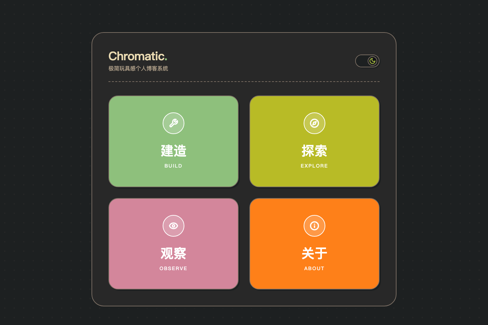

# Chromatic

Chromatic 是一个基于 Astro 构建的玩具盒 (Toy-Box) 风格个人博客，具有生动、可触感的交互界面设计。

- 在线预览：https://z1645444.github.io/
- 运行环境：Node.js 22.12 或更高版本、pnpm 10
- 许可证：MIT



## 项目特点

- 基于 Astro 构建，具有优秀的加载性能与 SEO 体验。
- 采用模块化的玩具盒式四象限导航设计（建造、探索、观察、关于）。
- 原生支持 Markdown 与 MDX 文章。
- 自动生成 RSS 订阅源与站点地图。

## 目录结构

- `src/pages/` - 页面与路由
- `src/content/` - 博客文章与配置定义
- `src/components/` - UI 组件
- `src/layouts/` - 页面模版
- `src/styles/` - 全局样式与主题配置

## 常用命令

项目使用 pnpm 进行包管理。

| 命令                   | 描述                              |
| :--------------------- | :-------------------------------- |
| `pnpm install`         | 安装项目依赖                      |
| `pnpm dev`             | 启动本地开发服务器，默认端口 4321 |
| `pnpm build`           | 编译生成用于生产环境的静态站点    |
| `pnpm check`           | 检查 Astro、TypeScript 和内容类型 |
| `pnpm format`          | 使用 Prettier 格式化项目文件      |
| `pnpm format:check`    | 检查项目文件格式                  |
| `pnpm preview`         | 在本地预览生产环境构建效果        |
| `pnpm astro [command]` | 执行 Astro 命令行工具             |

## 二次开发

常用定制入口如下：

- `src/consts.ts`：站点标题、描述、分类、导航、图标和分类颜色。
- `src/styles/global.css`：亮色与暗色主题 Token、字体和公共组件样式。
- `src/pages/about.astro`：关于页面内容。
- `src/content/blog/`：示例文章和用户文章。
- `public/`：favicon 等无需 Astro 处理的静态资源。

站点标题、描述和日期语言分别由 `SITE_TITLE`、`SITE_DESCRIPTION`、`SITE_LOCALE` 控制。修改 `SITE_LOCALE` 后，HTML 的 `lang` 属性和文章日期格式会同步更新。

新增博客分类时，在 `QUADRANTS_CONFIG.quadrants` 中添加 `kind: 'category'` 的配置并使用已有图标名称。分类页面、导航颜色和内容校验会读取同一份配置。普通导航页面使用 `kind: 'page'`。

需要增加新图标时：

1. 在 `QUADRANT_ICON_NAMES` 中加入图标名称。
2. 在 `src/components/QuadrantIcon.astro` 中加入对应 SVG。
3. 在分类配置的 `icon` 字段中使用该名称。

文章文件必须使用以下路径格式：

```text
src/content/blog/[category]/[YYYY]-[MM]-[DD]-[slug].md
```

文件目录、文件名日期以及 frontmatter 中的 `category`、`pubDate` 必须保持一致，构建时会自动校验。

发布自己的站点前，可以删除 `src/content/blog/` 中的示例文章以及 `src/assets/blog-placeholder-*.jpg`，然后添加自己的内容和图片。

## 作为模板使用

将 `chromatic-astro-demo` 推送到自己的 GitHub 仓库后，可以通过 Astro CLI 创建项目：

```bash
pnpm create astro@latest -- --template <github-owner>/chromatic-astro-demo
```

也可以直接克隆仓库，删除原有 `.git` 后重新初始化版本库。

## GitHub Pages

仓库内置 GitHub Pages 工作流。工作流会根据仓库名称自动区分用户站点和项目站点：

- `username.github.io` 部署到 `/`。
- 其他仓库部署到 `/<repository>/`。

如果使用自定义域名，在 GitHub 仓库的 Actions Variables 中设置 `SITE_URL`，例如 `https://blog.example.com`；站点部署在域名根路径时，同时将 `BASE_PATH` 设置为 `/`。本地模拟生产地址时也可以直接传入环境变量：

```bash
SITE_URL=https://blog.example.com BASE_PATH=/ pnpm build
```

本地也可以复制环境变量示例：

```bash
cp .env.example .env
```

如果生产构建没有配置 `SITE_URL`，构建过程会警告 canonical、RSS 和 sitemap 将使用 `example.com`。

所有站内链接都通过 Astro 的 `BASE_URL` 生成，因此 Theme 可以部署在域名根路径或 GitHub Pages 子路径。
